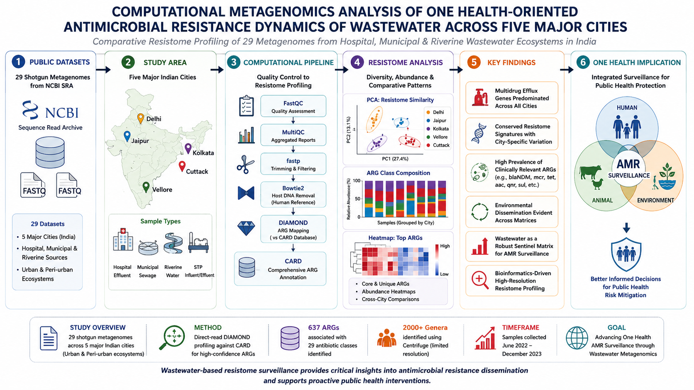
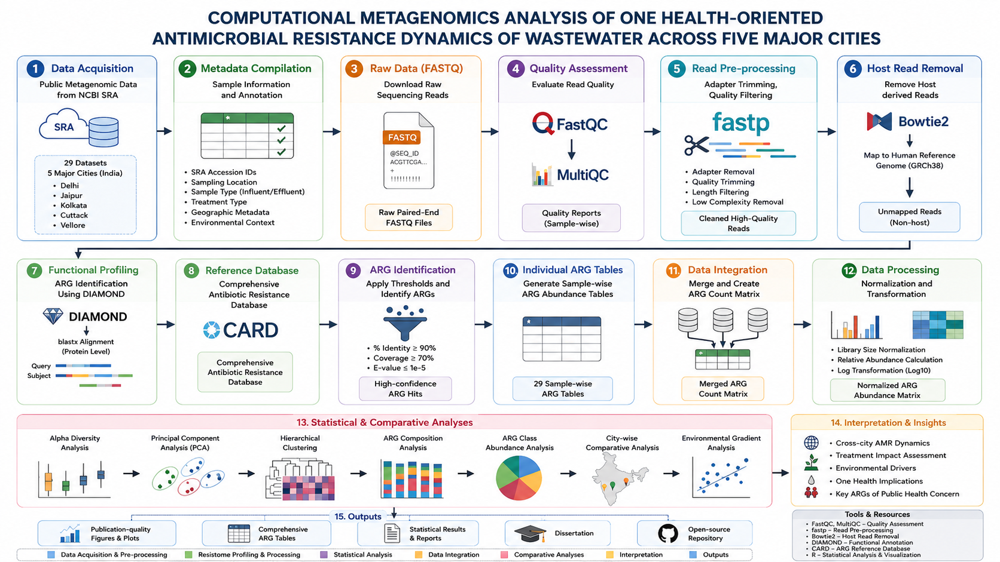
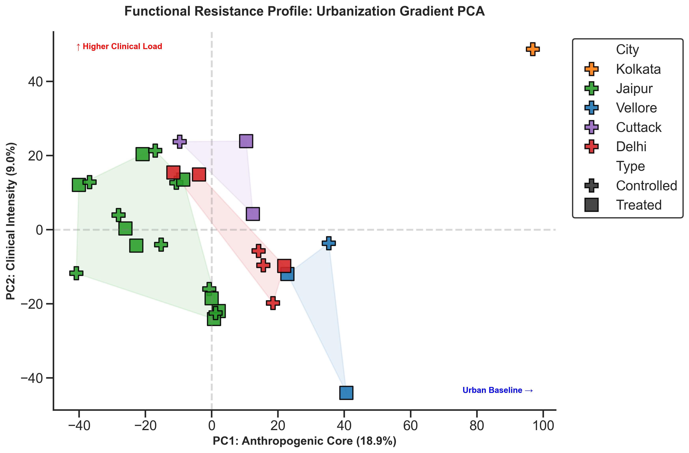
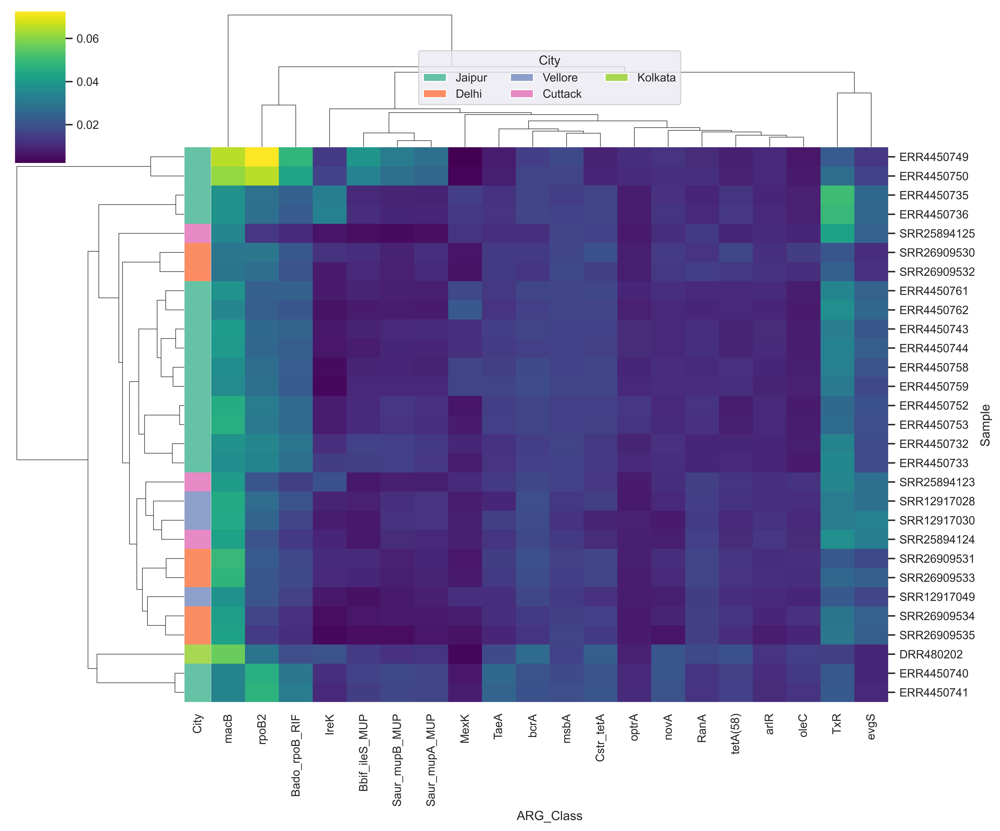
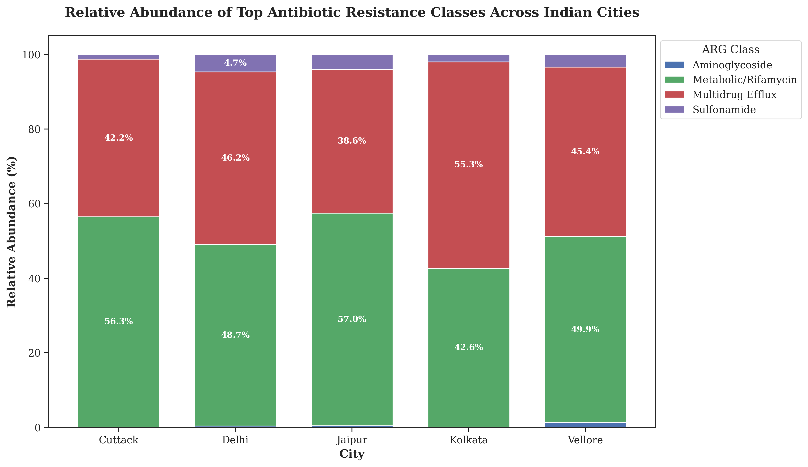
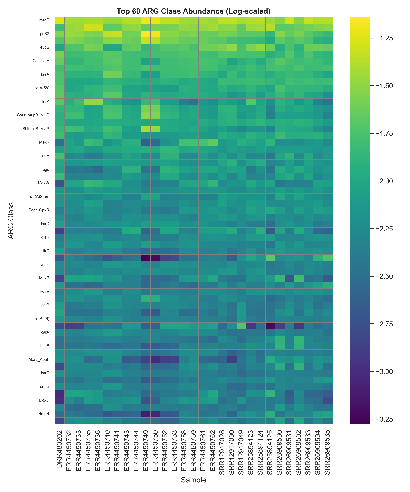

# COMPUTATIONAL METAGENOMICS ANALYSIS OF ONE HEALTH-ORIENTED ANTIMICROBIAL RESISTANCE DYNAMICS OF WASTEWATER ACROSS FIVE MAJOR CITIES


## Table of Contents
1. [Project Overview](#project-overview)
2. [Graphical Abstract](#graphical-abstract)
3. [Background & One Health Framework](#background--one-health-framework)
4. [Research Objectives](#research-objectives)
5. [Study Highlights](#study-highlights)
6. [Study Summary](#study-summary)
7. [Repository Architecture](#repository-architecture)
8. [Bioinformatics Workflow](#bioinformatics-workflow)
9. [Major Findings](#major-findings)
10. [Main Figures](#main-figures)
11. [Dataset Summary](#dataset-summary)
12. [Reproducibility](#reproducibility)
13. [Software Versions](#software-versions)
14. [Citation](#citation)
15. [License](#license)
16. [Acknowledgements](#acknowledgements)

---

## Project Overview
This repository serves as the official companion for the Master's dissertation **COMPUTATIONAL METAGENOMICS ANALYSIS OF ONE HEALTH-ORIENTED ANTIMICROBIAL RESISTANCE DYNAMICS OF WASTEWATER ACROSS FIVE MAJOR CITIES**. It provides processed datasets, publication-quality figures, metadata, and a transparent bioinformatics workflow. The emphasis of this repository is placed on scientific reproducibility, computational transparency, and long-term maintainability.

## Graphical Abstract


## Background & One Health Framework
Antimicrobial Resistance (AMR) is a rapidly escalating global health crisis. The **One Health framework** emphasizes the interconnectedness of human, animal, and environmental health. Wastewater treatment plants act as massive environmental reservoirs where genetic material from all three domains converges. Thus, wastewater-based epidemiology offers a uniquely powerful, non-invasive, population-level lens to monitor the environmental dissemination of AMR genes.

## Research Objectives
1. Perform a comparative metagenomic analysis across five major Indian cities.
2. Characterize the resistome architecture using DIAMOND against the CARD database.
3. Validate wastewater as a robust surveillance tool for tracking AMR persistence within the One Health framework.

## Study Highlights
- Comparative metagenomic analysis across five major Indian cities
- Twenty-nine publicly available shotgun metagenomic datasets
- DIAMOND-based resistome profiling against CARD
- Publication-quality comparative visualization framework
- Reproducible computational workflow
- One Health perspective for environmental AMR surveillance

## Study Summary

| Metric | Details |
|--------|---------|
| **Study Area** | India |
| **Cities** | Five |
| **Samples** | Twenty-nine |
| **Primary Database** | CARD |
| **Primary Tool** | DIAMOND |
| **Programming Language** | Python (Jupyter) |
| **Study Type** | Comparative Metagenomic Analysis |
| **Focus** | Antimicrobial Resistance |
| **Framework** | One Health |

## Repository Architecture

The architecture of this project flows from data acquisition to final publication outputs:

```text
       NCBI SRA
           ↓
     Processed Data
           ↓
       ARG Tables
           ↓
     Merged Dataset
           ↓
  Statistical Analysis
           ↓
  Publication Figures
           ↓
     Dissertation
```

## Bioinformatics Workflow

The computational pipeline utilized to generate the processed data and figures:

```text
             Public SRA datasets
                      ↓
         Dataset metadata compilation
                      ↓
                  Raw FASTQ
                      ↓
                   FastQC
                      ↓
                   MultiQC
                      ↓
                    fastp
                      ↓
                   Bowtie2
                      ↓
             Host-filtered reads
                      ↓
                DIAMOND blastx
                      ↓
                CARD database
                      ↓
              ARG identification
                      ↓
            Individual ARG tables
                      ↓
              Merged ARG matrix
                      ↓
                Normalization
                      ↓
             Log transformation
                      ↓
         Relative abundance analysis
                      ↓
        Principal Component Analysis
                      ↓
          Hierarchical clustering
                      ↓
           Cross-city comparison
                      ↓
       Environmental gradient analysis
                      ↓
      Publication-quality visualization
                      ↓
          Biological interpretation
                      ↓
            Master's Dissertation
                      ↓
        Open-source GitHub repository
```

## Major Findings
- **Core Resistome:** Identified a highly persistent core resistome distributed across distinct urban wastewater ecosystems in India.
- **Wastewater Viability:** Validated municipal wastewater as a statistically robust matrix for population-level AMR monitoring.
- **Dominant Mechanisms:** Discovered high relative abundances of multidrug efflux pumps and specific antibiotic-class resistances reflecting broader prescription patterns.

## Main Figures

### 1. Workflow


### 2. PCA of Urban AMR


### 3. Global Heatmap


### 4. ARG Composition


### 5. ARG Class Heatmap


## Dataset Summary
The project analyzed 29 publicly available shotgun metagenomic datasets sourced from the NCBI Sequence Read Archive (SRA). Due to file size constraints and public availability, raw FASTQ files are excluded from this repository. Instead, the processed abundance counts (`arg_final.csv`), normalized matrices (`arg_final_clean.tsv`), and individual sample tables (`*_ARG_table.tsv`) are provided in the `data/` directory.

## Reproducibility
This repository is structured to ensure full computational reproducibility:
- **Software Requirements:** Refer to `scripts/software_versions.md` for the specific tools and Python libraries required.
- **Folder Dependencies:** Ensure the `data/` and `figures/` paths are correctly mapped relative to the Jupyter Notebooks.
- **Expected Inputs:** Analysis relies on the normalized `arg_final_clean.tsv` matrix.
- **Expected Outputs:** Python/Jupyter analytical notebooks reproduce the publication-quality PDFs and PNGs found in `figures/`.
- **Assumptions:** Host-filtering and CARD annotations are assumed correct based on the explicitly declared bioinformatics pipeline parameters.

## Software Versions
For detailed documentation on the bioinformatics software utilized (including versions, purposes, inputs, and outputs), please refer to `scripts/software_versions.md`.

## Citation
If you utilize this repository or the related findings, please cite it using the provided `CITATION.cff` or as follows:

> Meshram, P. (2026). COMPUTATIONAL METAGENOMICS ANALYSIS OF ONE HEALTH-ORIENTED ANTIMICROBIAL RESISTANCE DYNAMICS OF WASTEWATER ACROSS FIVE MAJOR CITIES. GitHub Repository.

## License
This repository is available under the MIT License. See [LICENSE](LICENSE) for details.

## Acknowledgements
Special thanks to the open-source software community and the NCBI for hosting the SRA databases.
